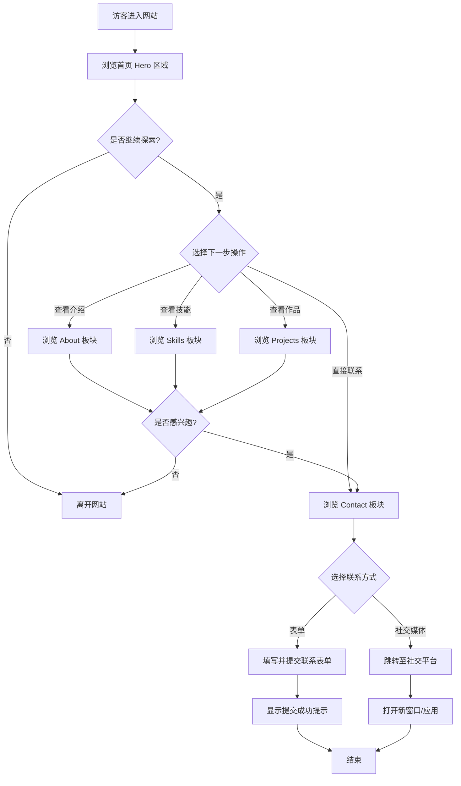
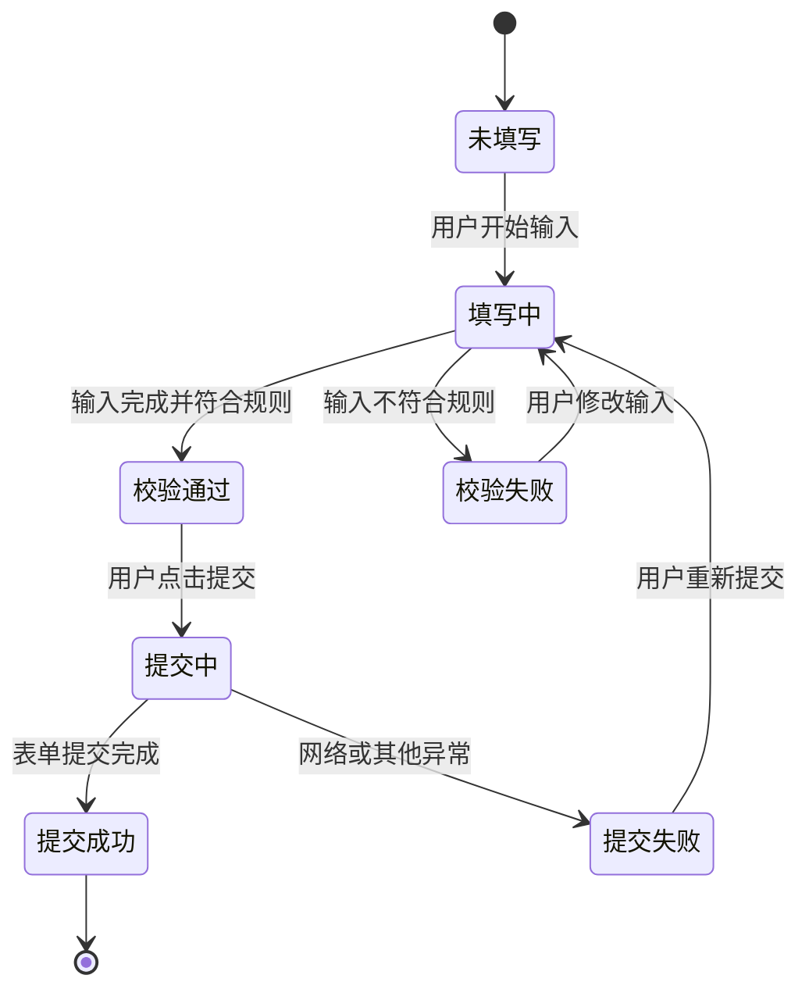

# 产品需求文档：个人作品集网站 - V1.0

## 1. 综述 (Overview)

### 1.1 项目背景与核心问题

**项目名称**：卢嘉豪个人作品集网站 (Lu Jiahao Personal Portfolio)

**核心问题**：
作为一名 AIGC 内容创作者、Prompt 工程师和 AI Agent 开发者，需要一个专业的个人作品集网站来：
1. 展示个人技能和专业能力
2. 建立个人品牌形象
3. 提供联系方式以便潜在合作方沟通
4. 作为社交媒体流量的承接平台

**项目定位**：
- 静态个人作品集网站
- 以 AIGC 和 AI 内容创作能力为核心展示内容
- 面向中文用户群体

### 1.2 核心业务流程 / 用户旅程地图

```
访客通过链接/搜索进入网站
    │
    ├─→ 【阶段一：第一印象】
    │   └─→ 浏览首页 Hero 区域，了解网站主人的多重身份
    │       目标：在 3 秒内建立专业认知，激发继续探索的意愿
    │
    ├─→ 【阶段二：建立信任】
    │   ├─→ 查看 About 个人介绍，了解创作者背景和理念
    │   └─→ 浏览 Skills 技能展示，评估专业能力匹配度
    │       目标：确认网站主人的专业能力，建立合作信心
    │
    ├─→ 【阶段三：查看成果】
    │   └─→ 访问 Projects 板块，查看作品案例（当前链接至社交媒体）
    │       目标：通过实际作品验证能力
    │
    └─→ 【阶段四：建立联系】
        └─→ 通过 Contact 表单或社交媒体联系网站主人
            目标：发起合作咨询或业务沟通
```

### 1.3 Mermaid 图（流程/状态/时序）

#### 1.3.1 用户操作流（必填）



#### 1.3.2 联系表单状态机（必填）



---

## 2. 用户故事详述 (User Stories)

---

### 阶段一：第一印象

---

#### **US-01: 作为访客，我希望看到引人注目的首页展示，以便快速了解网站主人的专业身份**

*   **价值陈述 (Value Statement)**:
    *   **作为** 潜在合作方或访客
    *   **我希望** 在进入网站时快速了解网站主人的专业身份
    *   **以便于** 判断是否继续深入了解

*   **业务规则与逻辑 (Business Logic)**:
    1.  **前置条件**: 无
    2.  **操作流程 (Happy Path)**:
        1. 用户通过链接或搜索引擎进入网站
        2. 首页 Hero 区域全屏展示，包含：
           - 打字机动画效果，循环显示多重身份（AIGC内容创作者、Prompt工程师、AI Agent开发者、AI视频创作者）
           - 主标题和副标题
           - 两个 CTA 按钮："查看作品"、"联系我"
           - 社交媒体图标链接（小红书、抖音、邮箱）
           - 装饰性代码窗口（显示 JavaScript 对象格式）
        3. 背景有浮动的渐变色球动画效果
        4. 背景网格叠加，营造科技感
    3.  **异常处理 (Error Handling)**:
        - JavaScript 加载失败时，静态文本仍可正常显示
        - 动画失效时，降级为静态展示，不影响核心内容阅读

*   **验收标准 (Acceptance Criteria)**:
    *   **场景1: 正常展示**
        *   **GIVEN** 访客正常打开网站
        *   **WHEN** 页面加载完成
        *   **THEN** 应显示完整的 Hero 区域，包括打字机动画、CTA 按钮、社交媒体图标、代码窗口
    *   **场景2: 打字机动画**
        *   **GIVEN** 页面已加载完成
        *   **WHEN** 观察标题区域
        *   **THEN** 应看到文字逐字输入效果，循环展示 4 个身份标签，每个标签停留 2 秒后切换
    *   **场景3: CTA 按钮点击**
        *   **GIVEN** 访客浏览首页
        *   **WHEN** 点击"查看作品"按钮
        *   **THEN** 页面应平滑滚动至 Projects 板块；点击"联系我"应滚动至 Contact 板块
    *   **场景4: 社交媒体链接**
        *   **GIVEN** 访客点击社交媒体图标
        *   **WHEN** 点击图标
        *   **THEN** 应在新窗口打开对应的社交媒体主页

*   **页面布局线框图 (ASCII Wireframe)**:
    ```text
    +----------------------------------------------------------------------+
    |  [≡]                    Lu Jiahao                         [X] [📧]   |
    +----------------------------------------------------------------------+
    |                                                                      |
    |                                                                      |
    |                        你好，我是卢嘉豪                               |
    |                                                                      |
    |                  [ AIGC内容创作者█ ]                                  |
    |                 (打字机动画，光标闪烁)                                |
    |                                                                      |
    |            用AI点燃创意，让技术为内容赋能                              |
    |                                                                      |
    |           [ 查看作品 ]           [ 联系我 ]                            |
    |                                                                      |
    |        [小红书]  [抖音]  [邮箱]                                       |
    |                                                                      |
    |    +--------------------------+                                      |
    |    | const creator = {        |                                      |
    |    |   role: "AIGC Creator",  |                                      |
    |    |   passion: "100%",        |  (浮动渐变球背景动画)               |
    |    |   mission: "Ignite..."   |                                      |
    |    | };                        |                                      |
    |    +--------------------------+                                      |
    |                                                                      |
    +----------------------------------------------------------------------+
    ```

---

### 阶段二：建立信任

---

#### **US-02: 作为访客，我希望了解网站主人的背景和理念，以便判断是否值得信任**

*   **价值陈述 (Value Statement)**:
    *   **作为** 潜在合作方
    *   **我希望** 了解网站主人的个人背景、创作理念和成就数据
    *   **以便于** 评估合作价值和信任度

*   **业务规则与逻辑 (Business Logic)**:
    1.  **前置条件**: 用户已滚动至 About 板块
    2.  **操作流程 (Happy Path)**:
        1. 用户向下滚动进入 About 板块
        2. 左侧展示个人介绍文字，包括：
           - 标题："关于我"
           - 简介：专注 AIGC 内容创作，擅长 Prompt 工程、AI Agent 开发等
           - 理念："AI 是工具，创意是灵魂"
        3. 右侧展示统计数据卡片，包括：
           - 100% 热情
           - 999+ 创意
           - 1 个使命
        4. 统计数字有滚动触发后的计数动画效果
        5. 进入视口时触发淡入动画
    3.  **异常处理 (Error Handling)**:
        - 动画失效时，数字直接显示最终值

*   **验收标准 (Acceptance Criteria)**:
    *   **场景1: 内容展示**
        *   **GIVEN** 用户滚动到 About 板块
        *   **WHEN** 板块进入视口
        *   **THEN** 应显示完整的个人介绍和统计数据
    *   **场景2: 计数动画**
        *   **GIVEN** 统计卡片在视口内
        *   **WHEN** 用户滚动使板块完全进入视口
        *   **THEN** 数字应从 0 开始计数动画，在约 2 秒内到达目标值
    *   **场景3: 滚动动画**
        *   **GIVEN** 板块在视口外
        *   **WHEN** 用户滚动使其进入视口
        *   **THEN** 内容应以淡入 + 上移的动画效果出现

*   **页面布局线框图 (ASCII Wireframe)**:
    ```text
    +----------------------------------------------------------------------+
    |                                                                      |
    |                          关于我                                      |
    |                        _______                                       |
    |                                                                      |
    |    +-----------------------+       +-----------------------------+  |
    |    |                       |       |  +-------+  +-------+  +---+ |  |
    |    |  我是一名专注于        |       |  |  100% |  | 999+  |  | 1 | |  |
    |    |  AIGC 内容创作的       |       |  | 热情  |  | 创意  |  | 使 ||  |
    |    |  创作者和技术探索者。  |       |  |       |  |       |  | 命 ||  |
    |    |                       |       |  +-------+  +-------+  +---+ |  |
    |    |  擅长将 AI 技术与      |       |                             |  |
    |    |  创意内容结合，用      |       |  "AI 是工具，创意是灵魂"      |  |
    |    |  Prompt 工程激活无限  |       |                             |  |
    |    |  可能。               |       |       [个人头像/视频框]       |  |
    |    |                       |       |                             |  |
    |    +-----------------------+       +-----------------------------+  |
    |                                                                      |
    +----------------------------------------------------------------------+
    ```

---

#### **US-03: 作为访客，我希望查看具体的技能清单，以便评估专业能力匹配度**

*   **价值陈述 (Value Statement)**:
    *   **作为** 潜在合作方
    *   **我希望** 清晰了解网站主人掌握的具体技能
    *   **以便于** 判断其能力是否与项目需求匹配

*   **业务规则与逻辑 (Business Logic)**:
    1.  **前置条件**: 用户已滚动至 Skills 板块
    2.  **操作流程 (Happy Path)**:
        1. 用户向下滚动进入 Skills 板块
        2. 技能分为两大类展示：
           - **AIGC 核心技能**：Prompt Engineering (90%)、AI Agent Development (85%)、AI Video Creation (88%)、AI Image Generation (82%)
           - **创作与运营**：Video Editing (80%)、Visual Design (75%)、Content Operations (85%)、Creative Planning (90%)
        3. 每个技能以卡片形式展示，包含技能名称和进度条
        4. 进度条在进入视口后触发填充动画
        5. 卡片支持 hover 效果，悬停时轻微上浮
    3.  **异常处理 (Error Handling)**:
        - 动画失效时，进度条直接显示最终宽度

*   **验收标准 (Acceptance Criteria)**:
    *   **场景1: 技能分类展示**
        *   **GIVEN** 用户滚动到 Skills 板块
        *   **WHEN** 板块进入视口
        *   **THEN** 应显示两大类技能，每类下有 4 个技能卡片
    *   **场景2: 进度条动画**
        *   **GIVEN** 技能卡片在视口内
        *   **WHEN** 板块完全进入视口
        *   **THEN** 进度条应从 0% 开始填充，约 1.5 秒到达目标百分比
    *   **场景3: Hover 交互**
        *   **GIVEN** 用户鼠标悬停在技能卡片上
        *   **WHEN** 悬停状态激活
        *   **THEN** 卡片应上浮约 5px，并增加阴影效果

*   **页面布局线框图 (ASCII Wireframe)**:
    ```text
    +----------------------------------------------------------------------+
    |                                                                      |
    |                          专业技能                                    |
    |                                                                      |
    +-----------------------------+        +-----------------------------+
    |      AIGC 核心技能          |        |      创作与运营              |
    +-----------------------------+        +-----------------------------+
    |                             |        |                             |
    |  +-----------------------+  |        |  +-----------------------+  |
    |  | Prompt Engineering     |  |        |  | Video Editing          |  |
    |  | ████████████████░░ 90% |  |        |  | ██████████████░░░  80% |  |
    |  +-----------------------+  |        |  +-----------------------+  |
    |                             |        |                             |
    |  +-----------------------+  |        |  +-----------------------+  |
    |  | AI Agent Development   |  |        |  | Visual Design          |  |
    |  | ███████████████░░░ 85% |  |        |  | ████████████░░░░░  75% |  |
    |  +-----------------------+  |        |  +-----------------------+  |
    |                             |        |                             |
    |  +-----------------------+  |        |  +-----------------------+  |
    |  | AI Video Creation      |  |        |  | Content Operations      |  |
    |  | ████████████████░  88% |  |        |  | ███████████████░░░ 85% |  |
    |  +-----------------------+  |        |  +-----------------------+  |
    |                             |        |                             |
    |  +-----------------------+  |        |  +-----------------------+  |
    |  | AI Image Generation    |  |        |  | Creative Planning       |  |
    |  | ███████████████░░░ 82% |  |        |  | ████████████████░  90% |  |
    |  +-----------------------+  |        |  +-----------------------+  |
    |                             |        |                             |
    +-----------------------------+        +-----------------------------+
    |                                                                      |
    +----------------------------------------------------------------------+
    ```

---

### 阶段三：查看成果

---

#### **US-04: 作为访客，我希望查看项目作品，以便验证实际能力**

*   **价值陈述 (Value Statement)**:
    *   **作为** 潜在合作方
    *   **我希望** 查看网站主人的实际项目作品
    *   **以便于** 验证其宣称的专业能力

*   **业务规则与逻辑 (Business Logic)**:
    1.  **前置条件**: 用户已滚动至 Projects 板块
    2.  **操作流程 (Happy Path)**:
        1. 用户向下滚动进入 Projects 板块
        2. 当前版本显示占位内容，引导至社交媒体平台查看作品
        3. 展示两个主要平台入口：
           - 小红书：展示平台图标 + 简介 + "查看更多"按钮
           - 抖音：展示平台图标 + 简介 + "查看更多"按钮
        4. 点击按钮在新窗口打开对应的社交媒体主页
    3.  **异常处理 (Error Handling)**:
        - 社交媒体链接失效时，建议用户直接搜索账号

*   **验收标准 (Acceptance Criteria)**:
    *   **场景1: 平台展示**
        *   **GIVEN** 用户滚动到 Projects 板块
        *   **WHEN** 板块进入视口
        *   **THEN** 应显示至少 2 个社交媒体平台的入口卡片
    *   **场景2: 外部链接**
        *   **GIVEN** 用户点击"查看更多"按钮
        *   **WHEN** 点击按钮
        *   **THEN** 应在新标签页打开对应的社交媒体主页

*   **页面布局线框图 (ASCII Wireframe)**:
    ```text
    +----------------------------------------------------------------------+
    |                                                                      |
    |                          我的作品                                    |
    |                                                                      |
    |    +-----------------------------+    +-----------------------------+|
    |    |                             |    |                             ||
    |    |      [小红书 图标]          |    |      [抖音 图标]            ||
    |    |                             |    |                             ||
    |    |   浏览我的 AIGC 创作内容    |    |   观看我的 AI 视频作品      ||
    |    |   和 Prompt 实用技巧        |    |   和创作幕后分享            ||
    |    |                             |    |                             ||
    |    |      [ 查看更多 → ]         |    |      [ 查看更多 → ]         ||
    |    |                             |    |                             ||
    |    +-----------------------------+    +-----------------------------+|
    |                                                                      |
    |                      更多项目持续更新中...                           |
    |                                                                      |
    +----------------------------------------------------------------------+
    ```

---

### 阶段四：建立联系

---

#### **US-05: 作为访客，我希望能够方便地联系网站主人，以便发起合作咨询**

*   **价值陈述 (Value Statement)**:
    *   **作为** 潜在合作方
    *   **我希望** 通过网站直接联系网站主人
    *   **以便于** 发起合作咨询或业务沟通

*   **业务规则与逻辑 (Business Logic)**:
    1.  **前置条件**: 用户已滚动至 Contact 板块
    2.  **操作流程 (Happy Path)**:
        1. 用户向下滚动进入 Contact 板块
        2. 左侧展示联系信息：
           - 状态指示："开放合作中"（带绿色在线指示灯）
           - 邮箱地址
           - 社交媒体链接
        3. 右侧展示联系表单，包含字段：
           - 姓名（必填）
           - 邮箱（必填，需格式验证）
           - 主题（必填）
           - 消息内容（必填，最少 10 字符）
           - 提交按钮
        4. 表单验证规则：
           - 所有字段必填
           - 邮箱格式验证
           - 消息内容最少 10 字符
        5. 提交成功后显示成功提示，清空表单
    3.  **异常处理 (Error Handling)**:
        - 验证失败时，在对应字段下方显示错误提示
        - 提交失败时，显示网络错误提示，允许重试

*   **验收标准 (Acceptance Criteria)**:
    *   **场景1: 正常提交**
        *   **GIVEN** 用户填写了所有必填字段且格式正确
        *   **WHEN** 用户点击"发送消息"按钮
        *   **THEN** 应显示提交成功提示，表单清空
    *   **场景2: 邮箱格式验证**
        *   **GIVEN** 用户输入了无效邮箱格式（如 "abc"）
        *   **WHEN** 用户点击提交或离开邮箱字段
        *   **THEN** 应在邮箱字段下方显示"请输入有效的邮箱地址"
    *   **场景3: 必填验证**
        *   **GIVEN** 用户有必填字段未填写
        *   **WHEN** 用户点击提交
        *   **THEN** 未填字段应高亮，下方显示"此字段为必填项"
    *   **场景4: 消息长度验证**
        *   **GIVEN** 用户输入的消息少于 10 字符
        *   **WHEN** 用户点击提交
        *   **THEN** 应显示"消息内容至少需要 10 个字符"

*   **页面布局线框图 (ASCII Wireframe)**:
    ```text
    +----------------------------------------------------------------------+
    |                                                                      |
    |                          联系我                                      |
    |                                                                      |
    |    +-----------------------+        +-----------------------------+ |
    |    |                       |        |  发送消息给我                | |
    |    |  ● 开放合作中         |        +-----------------------------+ |
    |    |                       |        |                             | |
    |    |  📧 邮箱:             |        |  姓名: [_______________]    | |
    |    |  your@email.com       |        |                             | |
    |    |                       |        |  邮箱: [_______________]    | |
    |    |  社交媒体:            |        |                             | |
    |    |  [小红书] [抖音]      |        |  主题: [_______________]    | |
    |    |                       |        |                             | |
    |    |  期待与您交流!         |        |  消息:                      | |
    |    |                       |        |  [_________________]        | |
    |    |                       |        |  [_________________]        | |
    |    |                       |        |                             | |
    |    |                       |        |        [ 发送消息 ]         | |
    |    +-----------------------+        +-----------------------------+ |
    |                                                                      |
    +----------------------------------------------------------------------+
    ```

---

### 全局功能

---

#### **US-06: 作为访客，我希望有流畅的导航和交互体验，以便轻松浏览网站内容**

*   **价值陈述 (Value Statement)**:
    *   **作为** 访客
    *   **我希望** 能够轻松导航到网站的各个板块
    *   **以便于** 快速找到我感兴趣的内容

*   **业务规则与逻辑 (Business Logic)**:
    1.  **前置条件**: 无
    2.  **操作流程 (Happy Path)**:
        1. 顶部固定导航栏，包含 Logo 和导航链接（首页、关于、技能、作品、联系）
        2. 点击导航链接，页面平滑滚动至对应板块
        3. 当前所在板块的导航链接高亮显示（下划线动画）
        4. 背景渐变球随鼠标移动产生视差效果
        5. 滚动时内容板块淡入显示
        6. 滚动超过一定距离后，显示"返回顶部"按钮
        7. 移动端显示汉堡菜单，点击展开/收起
    3.  **异常处理 (Error Handling)**:
        - JavaScript 失效时，导航链接仍可作为锚点跳转

*   **验收标准 (Acceptance Criteria)**:
    *   **场景1: 导航点击**
        *   **GIVEN** 用户在网站的任何位置
        *   **WHEN** 点击导航栏的"技能"链接
        *   **THEN** 页面应平滑滚动至 Skills 板块顶部
    *   **场景2: 导航高亮**
        *   **GIVEN** 用户滚动到 Skills 板块
        *   **WHEN** 板块进入视口中央区域
        *   **THEN** 导航栏的"技能"链接应显示高亮下划线
    *   **场景3: 返回顶部**
        *   **GIVEN** 用户滚动至页面底部
        *   **WHEN** 点击"返回顶部"按钮
        *   **THEN** 页面应平滑滚动回顶部
    *   **场景4: 移动端菜单**
        *   **GIVEN** 用户使用移动设备访问
        *   **WHEN** 点击汉堡菜单图标
        *   **THEN** 应展开/收起导航菜单，展示所有导航链接

*   **页面布局线框图 (ASCII Wireframe)**:
    ```text
    桌面端导航栏:
    +----------------------------------------------------------------------+
    |  Lu Jiahao      [首页]   [关于]   [技能]   [作品]   [联系]          |
    +----------------------------------------------------------------------+
                      ^^^^^^ (当前页面高亮)

    移动端导航栏:
    +----------------------------------------------------------------------+
    |  Lu Jiahao                                          [≡]              |
    +----------------------------------------------------------------------+
                                                  (点击后展开菜单)
                                                    +--------------+
                                                    |  首页         |
                                                    |  关于         |
                                                    |  技能         |
                                                    |  作品         |
                                                    |  联系         |
                                                    +--------------+
    ```

---

#### **US-07: 作为移动端用户，我希望网站在各种设备上都能正常显示，以便随时访问**

*   **价值陈述 (Value Statement)**:
    *   **作为** 移动端用户
    *   **我希望** 网站在我的设备上能够正常显示和操作
    *   **以便于** 随时随地了解网站主人信息

*   **业务规则与逻辑 (Business Logic)**:
    1.  **前置条件**: 无
    2.  **操作流程 (Happy Path)**:
        1. 网站采用移动优先的响应式设计
        2. 断点设置：
           - 桌面端：> 1024px
           - 平板：768px - 1024px
           - 移动端：< 768px
           - 小屏移动端：< 480px
        3. 移动端调整：
           - 导航栏简化为汉堡菜单
           - 多列布局变为单列
           - 字体大小适当调整
           - 触摸友好的按钮尺寸
    3.  **异常处理 (Error Handling)**:
        - 超小屏幕（< 360px）保持基本可用性

*   **验收标准 (Acceptance Criteria)**:
    *   **场景1: 桌面端显示**
        *   **GIVEN** 用户使用 1920x1080 分辨率访问
        *   **WHEN** 页面加载完成
        *   **THEN** 内容应正常多列显示，导航栏显示完整链接
    *   **场景2: 移动端显示**
        *   **GIVEN** 用户使用 375x667 分辨率访问
        *   **WHEN** 页面加载完成
        *   **THEN** 内容应单列显示，导航栏显示汉堡菜单，所有按钮可点击
    *   **场景3: 平板显示**
        *   **GIVEN** 用户使用 768x1024 分辨率访问
        *   **WHEN** 页面加载完成
        *   **THEN** 内容应适当调整布局，保持可读性

---

## 3. 技术规范

### 3.1 技术栈

| 类别 | 技术选择 |
|------|----------|
| 前端框架 | 纯 HTML5 / CSS3 / JavaScript（无框架） |
| 图标库 | Font Awesome 6.5.1 |
| 字体 | Space Grotesk（标题）、Noto Sans SC（中文） |
| 设计风格 | Glassmorphism（玻璃态）+ 紫蓝渐变主题 |

### 3.2 设计规范

| 项目 | 值 |
|------|-----|
| 主色调 | #8b5cf6（紫色） |
| 辅助色 | #ec4899（粉色） |
| 强调色 | #06b6d4（青色） |
| 背景色 | #0a0a1a、#13132b（深空蓝） |
| 字体-标题 | Space Grotesk |
| 字体-正文 | Noto Sans SC |

### 3.3 性能要求

- 首屏加载时间 < 2 秒
- 动画帧率 ≥ 60fps
- 支持现代浏览器（Chrome、Firefox、Safari、Edge 最新版本）

---

## 4. 非功能性需求

### 4.1 可访问性

- 使用语义化 HTML 标签
- 图片包含 alt 属性
- 键盘导航支持

### 4.2 浏览器兼容性

- Chrome 90+
- Firefox 88+
- Safari 14+
- Edge 90+

### 4.3 SEO

- 包含 meta 标题和描述
- 语义化结构有利于搜索引擎抓取

---

## 5. 附录

### 5.1 术语表

| 术语 | 说明 |
|------|------|
| AIGC | AI Generated Content，AI 生成内容 |
| Prompt Engineering | 提示词工程，设计和优化 AI 提示词的技术 |
| AI Agent | AI 智能体，能够自主执行任务的 AI 系统 |
| Glassmorphism | 玻璃态设计风格，特征包括半透明、模糊背景 |

### 5.2 变更记录

| 版本 | 日期 | 变更内容 | 作者 |
|------|------|----------|------|
| v1.0 | 2025-02-09 | 初始版本，基于现有功能编写 | Claude |

---

*文档结束*
