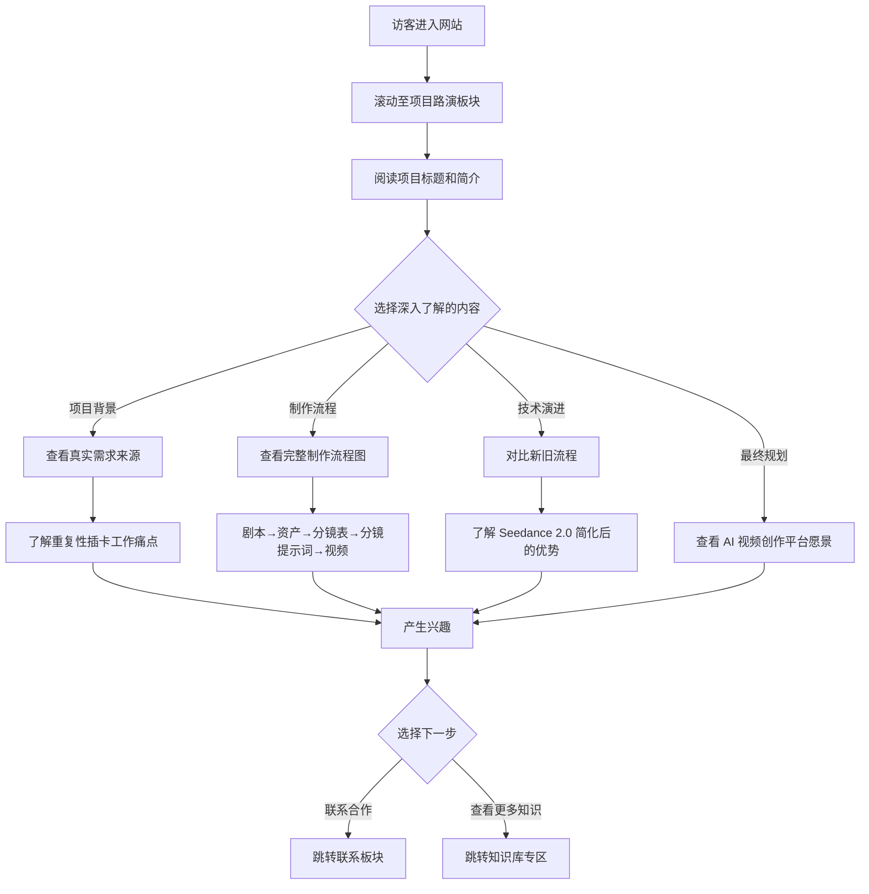
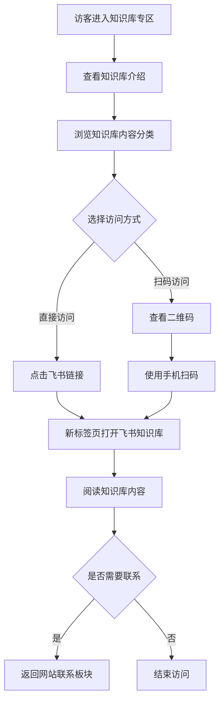

# 产品需求文档：个人作品集网站 - V2.0

## 1. 综述 (Overview)

### 1.1 项目背景与核心问题

**项目名称**：卢嘉豪个人作品集网站 v2.0

**版本说明**：在 v1.0 基础上新增三大功能板块，丰富网站内容展示维度

**核心问题**：
v1.0 版本已成功建立个人品牌形象和合作入口，但缺少以下关键内容的系统化展示：
1. **项目路演**：需要一个专门区域展示 AI 短剧创作平台的完整项目历程，从需求发现到技术演进
2. **Vibe Coding 经验**：希望分享个人在 AI 辅助编程方面的实践经验和方法论
3. **知识库专区**：需要引导访客访问飞书知识库，获取更深入的技术内容

**项目定位**：
- v1.0 的功能增强版本
- 保持原有设计风格和交互体验
- 新增内容以卡片、时间轴、流程图等可视化形式呈现

### 1.2 核心业务流程 / 用户旅程地图（v2.0 更新）

```
访客通过链接/搜索进入网站
    │
    ├─→ 【阶段一：第一印象】(首页 Hero)
    │   └─→ 浏览首页 Hero 区域，了解网站主人的多重身份
    │
    ├─→ 【阶段二：建立信任】(关于 + 技能)
    │   ├─→ 查看 About 个人介绍
    │   └─→ 浏览 Skills 技能展示
    │
    ├─→ 【阶段三：了解实践】★ v2.0 新增
    │   ├─→ 项目路演：了解 AI 短剧创作平台项目
    │   │   ├── 真实需求来源
    │   │   ├── 前期准备（完整制作流程）
    │   │   ├── 项目开发（用秒哒完成开发）
    │   │   ├── 技术进步（Seedance 2.0 简化流程）
    │   │   └── 最终规划（AI 视频创作平台）
    │   │
    │   ├─→ Vibe Coding 经验：学习 5 条经验方法论
    │   │   ├── 1. 找到自己的需求
    │   │   ├── 2. 先完成一个 demo 实现
    │   │   ├── 3. 明确清晰的需求后写 PRD 文档
    │   │   ├── 4. 根据 PRD 每次只完成一个阶段的开发
    │   │   └── 5. 只完成 MVP 实现，不要想着一次就完美
    │   │
    │   └─→ 知识库专区：访问飞书知识库
    │
    ├─→ 【阶段四：查看成果】(作品展示)
    │   └─→ 访问 Projects 板块
    │
    └─→ 【阶段五：建立联系】(联系合作)
        └─→ 通过 Contact 表单或社交媒体联系
```

### 1.3 Mermaid 图（流程/状态/时序）

#### 1.3.1 项目路演用户操作流（v2.0 新增）



#### 1.3.2 知识库访问流程（v2.0 新增）



---

## 2. 用户故事详述 (User Stories)

> **说明**：v2.0 保留 v1.0 的所有用户故事（US-01 至 US-07），以下为新增用户故事。

---

### 阶段三：了解实践（v2.0 新增阶段）

---

#### **US-08: 作为访客，我希望了解网站主人的项目经验，以便评估其专业能力和实践经验**

*   **价值陈述 (Value Statement)**:
    *   **作为** 潜在合作方或技术学习者
    *   **我希望** 了解网站主人实际参与过的项目
    *   **以便于** 评估其实战能力和专业水平

*   **业务规则与逻辑 (Business Logic)**:
    1.  **前置条件**: 用户已滚动至"项目路演"板块
    2.  **操作流程 (Happy Path)**:
        1. 用户滚动进入项目路演板块
        2. 板块采用时间轴/流程图形式展示项目演进
        3. 展示内容包括：
           - **真实需求**：AI 短剧创作的重复性插卡工作痛点，多平台来回操作
           - **前期准备**：完整制作流程（剧本 → 资产 → 分镜表 → 分镜提示词 → 视频提示词）
           - **项目开发**：使用秒哒完成产品开发流程
           - **技术进步**：Seedance 2.0 带来的简化（剧本 + 资产直接输出视频）
           - **最终规划**：Seedance 2.0 驱动的 AI 视频创作平台
        4. 采用对比卡片展示新旧流程差异
        5. 进入视口时触发淡入动画
    3.  **异常处理 (Error Handling)**:
        - 动画失效时，内容正常显示

*   **验收标准 (Acceptance Criteria)**:
    *   **场景1: 项目背景展示**
        *   **GIVEN** 用户滚动到项目路演板块
        *   **WHEN** 板块进入视口
        *   **THEN** 应显示项目标题"AI 短剧创作平台"和真实需求描述
    *   **场景2: 流程对比展示**
        *   **GIVEN** 用户浏览技术进步部分
        *   **WHEN** 查看新旧流程对比
        *   **THEN** 应清晰展示：旧流程（5步）vs 新流程（2步）
    *   **场景3: 视觉呈现**
        *   **GIVEN** 用户浏览项目路演板块
        *   **WHEN** 板块进入视口
        *   **THEN** 内容应以卡片/流程图形式呈现，配以图标和渐变背景

*   **页面布局线框图 (ASCII Wireframe)**:
    ```text
    +----------------------------------------------------------------------+
    |                                                                      |
    |                          05. 项目路演                                |
    |                        _______                                       |
    |                                                                      |
    +----------------------------------------------------------------------+
    |                                                                      |
    |    【项目标题】AI 短剧创作平台                                       |
    |    【项目简介】从重复劳动到智能创作，用 AI 技术改变视频制作流程     |
    |                                                                      |
    +----------------------------------------------------------------------+
    |                                                                      |
    |    ┌─────────────────────────────────────────────────────────────┐  |
    |    │  📋 真实需求                                                │  |
    |    │                                                             │  |
    |    │  AI短剧创作中的重复性插卡工作，每次需要多个平台来回跑进行   │  |
    |    │  创作，效率低下且容易出错。                                 │  |
    |    └─────────────────────────────────────────────────────────────┘  |
    |                                                                      |
    +----------------------------------------------------------------------+
    |                                                                      |
    |    ┌─────────────────────────────────────────────────────────────┐  |
    |    │  🎬 前期准备 - 完整制作流程                                  │  |
    │    │                                                             │  |
    |    │  ┌───────┐    ┌───────┐    ┌───────┐    ┌───────────┐      │  |
    |    │  │ 剧本  │───→│ 资产  │───→│ 分镜表 │───→│ 分镜提示词 │      │  |
    |    │  └───────┘    └───────┘    └───────┘    └───────────┘      │  |
    |    │                                                  ↓          │  |
    |    │                                          ┌───────────────┐   │  |
    |    │                                          │  视频提示词   │   │  |
    |    │                                          └───────────────┘   │  |
    |    └─────────────────────────────────────────────────────────────┘  |
    |                                                                      |
    +----------------------------------------------------------------------+
    |                                                                      |
    |    ┌───────────────────────────┐    ┌───────────────────────────┐  |
    |    │  🔧 项目开发               │    │  ⚡ 技术进步               │  |
    |    │                           │    │                           │  |
    |    │  用「秒哒」完成整个        │    │  Seedance 2.0 出现！      │  |
    |    │  产品开发流程              │    │  直接 剧本+资产 → 视频     │  |
    │    │                           │    │  去除中间繁琐步骤          │  |
    │    └───────────────────────────┘    └───────────────────────────┘  |
    |                                                                      |
    +----------------------------------------------------------------------+
    |                                                                      |
    |    ┌─────────────────────────────────────────────────────────────┐  |
    |    │  🚀 最终规划                                                │  |
    |    │                                                             │  |
    |    │  Seedance 2.0 驱动下的 AI 视频创作平台                      │  |
    |    │  不仅仅是做 AI 短剧，而是整个 AI 视频的创作                 │  |
    |    └─────────────────────────────────────────────────────────────┘  |
    |                                                                      |
    +----------------------------------------------------------------------+
    ```

---

#### **US-09: 作为开发者/学习者，我希望学习 Vibe Coding 经验方法，以便提升自己的开发效率**

*   **价值陈述 (Value Statement)**:
    *   **作为** 开发者或 AI 编程爱好者
    *   **我希望** 学习网站主人的 Vibe Coding 经验
    *   **以便于** 提升自己的开发效率和代码质量

*   **业务规则与逻辑 (Business Logic)**:
    1.  **前置条件**: 用户已滚动至"Vibe Coding 经验"板块
    2.  **操作流程 (Happy Path)**:
        1. 用户滚动进入 Vibe Coding 经验板块
        2. 以卡片列表形式展示 5 条经验，每条经验包含：
           - 序号（01-05）
           - 标题
           - 简短说明
           - 可选的图标/emoji
        3. 卡片支持 hover 效果，悬停时轻微上浮并增加阴影
        4. 5 条经验按顺序排列：
           1. 找到自己的需求
           2. 先完成一个 demo 实现
           3. 明确清晰的需求后写 PRD 文档
           4. 根据 PRD 文档每次只完成一个阶段的开发
           5. 只完成 MVP 实现，不要想着一次就完美
    3.  **异常处理 (Error Handling)**:
        - 动画失效时，卡片正常显示

*   **验收标准 (Acceptance Criteria)**:
    *   **场景1: 经验列表展示**
        *   **GIVEN** 用户滚动到 Vibe Coding 经验板块
        *   **WHEN** 板块进入视口
        *   **THEN** 应显示 5 条经验卡片，有序号、标题和说明
    *   **场景2: Hover 交互**
        *   **GIVEN** 用户鼠标悬停在经验卡片上
        *   **WHEN** 悬停状态激活
        *   **THEN** 卡片应上浮约 5px，边框高亮显示
    *   **场景3: 移动端展示**
        *   **GIVEN** 用户使用移动设备访问
        *   **WHEN** 浏览经验板块
        *   **THEN** 卡片应单列显示，保持可读性

*   **页面布局线框图 (ASCII Wireframe)**:
    ```text
    +----------------------------------------------------------------------+
    |                                                                      |
    |                          06. Vibe Coding 经验                        |
    |                        _______                                       |
    |                                                                      |
    |    我的 AI 辅助编程方法论，帮助你更高效地完成开发                    |
    |                                                                      |
    +----------------------------------------------------------------------+
    |                                                                      |
    |    ┌─────────┐    ┌─────────┐    ┌─────────┐                        |
    |    │   01    │    │   02    │    │   03    │                        |
    |    │ 找到    │    │ 先完成  │    │ 写PRD   │                        |
    |    │ 自己的  │    │ 一个    │    │ 文档    │                        |
    │    │ 需求    │    │ demo    │    │         │                        |
    │    └─────────┘    └─────────┘    └─────────┘                        |
    |                                                                      |
    +----------------------------------------------------------------------+
    |                                                                      |
    |    ┌─────────────────────────────────────────────────────────────┐  |
    |    │  01. 找到自己的需求                                        │  |
    │    │  从解决自己的真实痛点开始，这样的需求最清晰，动力最足。     │  |
    |    └─────────────────────────────────────────────────────────────┘  |
    |                                                                      |
    |    ┌─────────────────────────────────────────────────────────────┐  |
    |    │  02. 先完成一个 demo 实现                                  │  |
    │    │  不要想太多，先让东西跑起来，能工作的代码就是好代码。       │  |
    │    └─────────────────────────────────────────────────────────────┘  |
    |                                                                      |
    |    ┌─────────────────────────────────────────────────────────────┐  |
    │    │  03. 明确清晰的需求后写 PRD 文档                           │  |
    │    │  理清思路后再动手，避免边做边改导致的方向迷失。             │  |
    │    └─────────────────────────────────────────────────────────────┘  |
    |                                                                      |
    |    ┌─────────────────────────────────────────────────────────────┐  |
    │    │  04. 根据 PRD 文档每次只完成一个阶段的开发                 │  |
    │    │  把大任务拆小，逐个击破，每完成一步都是进展。               │  |
    │    └─────────────────────────────────────────────────────────────┘  |
    |                                                                      |
    |    ┌─────────────────────────────────────────────────────────────┐  |
    │    │  05. 只完成 MVP 实现，不要想着一次就完美                    │  |
    │    │  先做最小可用版本，快速验证，迭代比完美更重要。             │  |
    │    └─────────────────────────────────────────────────────────────┘  |
    |                                                                      |
    +----------------------------------------------------------------------+
    ```

---

#### **US-10: 作为深度学习者，我希望访问飞书知识库，以便获取更深入的技术内容**

*   **价值陈述 (Value Statement)**:
    *   **作为** 希望深入学习的访客
    *   **我希望** 能够方便地访问飞书知识库
    *   **以便于** 获取更系统和深入的技术内容

*   **业务规则与逻辑 (Business Logic)**:
    1.  **前置条件**: 用户已滚动至"知识库专区"板块
    2.  **操作流程 (Happy Path)**:
        1. 用户滚动进入知识库专区板块
        2. 板块包含：
           - 知识库标题和简介
           - 飞书知识库链接（按钮形式）
           - 可选的二维码（移动端扫码访问）
           - 知识库内容预览/分类提示
        3. 点击链接按钮在新标签页打开飞书知识库
        4. 知识库链接：https://pcn3kvelf0s9.feishu.cn/wiki/CnhWwGw0ciaaA7k2VEVckqz1nOc
    3.  **异常处理 (Error Handling)**:
        - 链接失效时，提示用户联系网站主人

*   **验收标准 (Acceptance Criteria)**:
    *   **场景1: 知识库入口展示**
        *   **GIVEN** 用户滚动到知识库专区板块
        *   **WHEN** 板块进入视口
        *   **THEN** 应显示知识库标题、简介和访问按钮
    *   **场景2: 外部链接跳转**
        *   **GIVEN** 用户点击"访问知识库"按钮
        *   **WHEN** 点击按钮
        *   **THEN** 应在新标签页打开飞书知识库
    *   **场景3: 移动端二维码**
        *   **GIVEN** 用户使用移动设备访问
        *   **WHEN** 浏览知识库专区
        *   **THEN** 可显示二维码供扫码访问（可选功能）

*   **页面布局线框图 (ASCII Wireframe)**:
    ```text
    +----------------------------------------------------------------------+
    |                                                                      |
    |                          07. 知识库专区                              |
    |                        _______                                       |
    |                                                                      |
    |    更深入的技术内容，系统化的知识整理                                |
    |                                                                      |
    +----------------------------------------------------------------------+
    |                                                                      |
    |    ┌─────────────────────────────────────────────────────────────┐  |
    |    │                                                             │  |
    |    │                    📚 飞书知识库                            │  |
    |    │                                                             │  |
    |    │  这里收录了我系统化的技术笔记、实战经验和学习心得。          │  |
    |    │  从 AI 工具使用到编程技巧，从项目复盘到方法论总结。          │  |
    |    │                                                             │  |
    │    │  内容包括：                                                 │  |
    |    │  • AIGC 创作技巧与 Prompt 工程                              │  |
    │    │  • AI Agent 开发实战                                       │  |
    │    │  • Vibe Coding 经验分享                                    │  |
    │    │  • 项目复盘与技术思考                                      │  |
    │    │                                                             │  |
    │    │                        ┌─────────────────┐                  │  |
    │    │                        │  🚀 访问知识库  │                  │  |
    │    │                        └─────────────────┘                  │  |
    │    │                                                             │  |
    │    └─────────────────────────────────────────────────────────────┘  |
    |                                                                      |
    |    ┌─────────────────────┐    ┌─────────────────────────────────┐   |
    |    │                     │    │  扫码访问                        │   |
    |    │    [二维码图片]      │    │  (移动端友好)                   │   |
    |    │                     │    │                                 │   |
    |    └─────────────────────┘    └─────────────────────────────────┘   |
    |                                                                      |
    +----------------------------------------------------------------------+
    ```

---

#### **US-11: 作为访客，我希望导航栏包含新增板块，以便快速访问新内容**

*   **价值陈述 (Value Statement)**:
    *   **作为** 访客
    *   **我希望** 导航栏能反映网站的所有板块
    *   **以便于** 快速跳转到感兴趣的新增内容

*   **业务规则与逻辑 (Business Logic)**:
    1.  **前置条件**: 网站已升级到 v2.0
    2.  **操作流程 (Happy Path)**:
        1. 导航栏新增三个链接：
           - "项目路演"（对应 #roadshow）
           - "经验分享"（对应 #vibecoding）
           - "知识库"（对应 #knowledge）
        2. 保持原有导航链接（首页、关于、技能、作品、联系）
        3. 新链接样式与原有链接一致
        4. 点击后平滑滚动至对应板块
    3.  **异常处理 (Error Handling)**:
        - JavaScript 失效时，链接仍可作为锚点跳转

*   **验收标准 (Acceptance Criteria)**:
    *   **场景1: 导航栏更新**
        *   **GIVEN** 网站升级到 v2.0
        *   **WHEN** 用户访问网站
        *   **THEN** 导航栏应包含 8 个链接：首页、关于、技能、作品、项目路演、经验分享、知识库、联系
    *   **场景2: 平滑滚动**
        *   **GIVEN** 用户点击"项目路演"导航链接
        *   **WHEN** 点击链接
        *   **THEN** 页面应平滑滚动至项目路演板块顶部
    *   **场景3: 移动端导航**
        *   **GIVEN** 用户使用移动设备访问
        *   **WHEN** 打开汉堡菜单
        *   **THEN** 新增链接应包含在移动菜单中

*   **页面布局线框图 (ASCII Wireframe)**:
    ```text
    桌面端导航栏 (v2.0):
    +----------------------------------------------------------------------+
    |  Lu Jiahao   [首页] [关于] [技能] [作品] [项目路演] [经验] [知识库] [联系] |
    +----------------------------------------------------------------------+

    移动端导航栏 (v2.0):
    +----------------------------------------------------------------------+
    |  Lu Jiahao                                          [≡]              |
    +----------------------------------------------------------------------+
                                                  (点击后展开菜单)
                                                    +--------------+
                                                    |  首页         |
                                                    |  关于         |
                                                    |  技能         |
                                                    |  作品         |
                                                    |  项目路演 ★   |
                                                    |  经验分享 ★   |
                                                    |  知识库 ★     |
                                                    |  联系         |
                                                    +--------------+
    ```

---

## 3. 技术规范（v2.0 更新）

### 3.1 技术栈（保持不变）

| 类别 | 技术选择 |
|------|----------|
| 前端框架 | 纯 HTML5 / CSS3 / JavaScript（无框架） |
| 图标库 | Font Awesome 6.5.1 |
| 字体 | Space Grotesk（标题）、Noto Sans SC（中文） |
| 设计风格 | Glassmorphism（玻璃态）+ 紫蓝渐变主题 |

### 3.2 新增板块编号

| 板块 | 编号 | 链接 ID |
|------|------|---------|
| 首页 Hero | - | #home |
| 关于我 | 01 | #about |
| 专业技能 | 02 | #skills |
| 作品展示 | 03 | #projects |
| 项目路演 | 05 | #roadshow |
| Vibe Coding 经验 | 06 | #vibecoding |
| 知识库专区 | 07 | #knowledge |
| 联系合作 | 04 | #contact |

### 3.3 设计规范（保持不变）

| 项目 | 值 |
|------|-----|
| 主色调 | #8b5cf6（紫色） |
| 辅助色 | #ec4899（粉色） |
| 强调色 | #06b6d4（青色） |
| 背景色 | #0a0a1a、#13132b（深空蓝） |

---

## 4. 非功能性需求（v2.0 更新）

### 4.1 性能要求

- 新增板块不应显著影响首屏加载时间
- 动画保持 60fps 流畅度
- 图片/二维码资源需要优化

### 4.2 可访问性

- 新增板块使用语义化 HTML 标签
- 外部链接明确标注为"新窗口打开"
- 保持键盘导航支持

### 4.3 SEO

- 更新 meta 描述，包含新增内容关键词
- 添加结构化数据标记（可选）

---

## 5. 版本变更记录

### 5.1 v1.0 → v2.0 变更摘要

| 类别 | 变更内容 |
|------|----------|
| 新增板块 | 项目路演、Vibe Coding 经验、知识库专区（3个） |
| 导航更新 | 新增 3 个导航链接 |
| 内容类型 | 新增流程图、对比卡片、经验卡片等组件 |
| 外部链接 | 新增飞书知识库链接 |

### 5.2 变更记录

| 版本 | 日期 | 变更内容 | 作者 |
|------|------|----------|------|
| v1.0 | 2025-02-09 | 初始版本，基础 5 大板块 | Claude |
| v2.0 | 2025-02-09 | 新增项目路演、Vibe Coding 经验、知识库专区；导航栏更新 | Claude |

---

## 6. 附录

### 6.1 术语表（v2.0 新增）

| 术语 | 说明 |
|------|------|
| Vibe Coding | 一种强调"先让代码跑起来"的 AI 辅助编程方法论 |
| MVP | Minimum Viable Product，最小可行产品 |
| Seedance | AI 视频生成工具/平台 |
| 秒哒 | AI 辅助开发工具 |

### 6.2 外部链接

| 名称 | 链接 |
|------|------|
| 飞书知识库 | https://pcn3kvelf0s9.feishu.cn/wiki/CnhWwGw0ciaaA7k2VEVckqz1nOc |

---

*文档结束*
